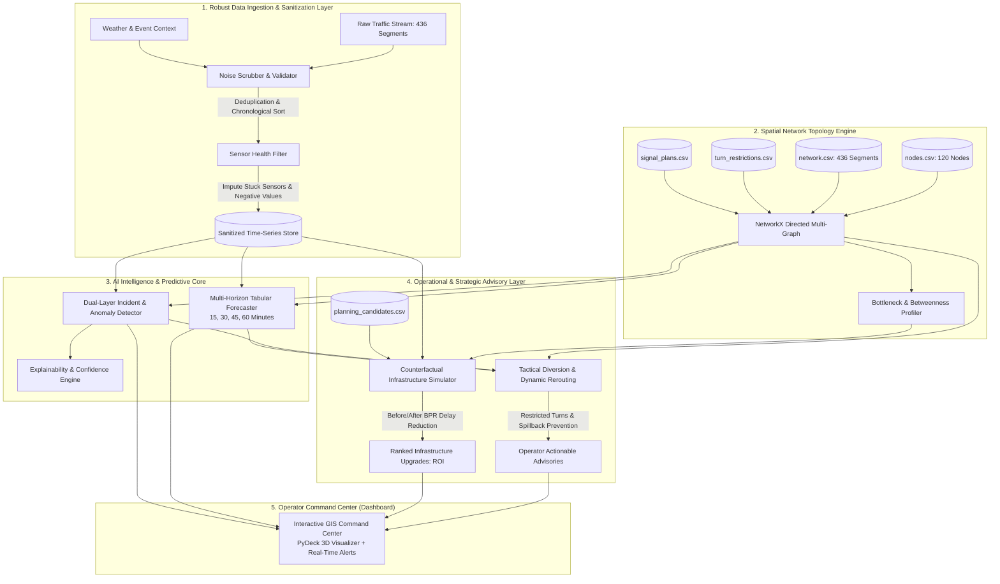

<div align="center">

# 🚦 CityFlow AI: Urban Traffic Flow & Incident Intelligence System
### *Next-Generation Decision-Support System for Dense Urban Road Networks*

[](https://www.python.org/)
[](LICENSE)
[](https://lightgbm.readthedocs.io/)
[](https://streamlit.io/)
[](#)

</div>

---

## 📌 Executive Summary & Problem Understanding

Modern metropolitan cities like **Hyderabad** face intense, dynamic urban mobility challenges. High-density mixed traffic, sharp peak-hour commuter surges between tech corridors (e.g., Hitec City, Gachibowli, Financial District) and residential hubs, frequent signalized intersections, complex flyover ramps, sudden monsoon flash rain slowdowns, and localized breakdown incidents lead to rapid congestion cascades and upstream spillback.

Traditional traffic management systems suffer from two catastrophic flaws:
1. **Reactive Operation**: Interventions occur only after corridors gridlock, causing severe commuter delay and economic loss.
2. **Disconnected Planning**: Daily operational diversion advisories are completely divorced from long-term capital infrastructure planning (flyovers, lane additions, junction geometry redesign).

### 🎯 Core Mission: Decision Support, Not a Navigation App
**CityFlow AI** is **not** another consumer turn-by-turn navigation app, nor is it a generic LLM chatbot wrapper. 

CityFlow AI is an **enterprise-grade, software-only decision-support platform for municipal traffic control centers (TCCs) and urban planning authorities**. It continuously analyzes road-network topologies and sensor streams to:
- **Infer** real-time network states and filter severe telemetry noise (stuck sensors, impossible negative readings, row shuffle, sensor drift).
- **Anticipate** congestion and flow conditions **15, 30, 45, and 60 minutes into the future** with quantified uncertainty.
- **Detect & Classify** localized incidents and abnormal traffic behavior while actively suppressing false alarms through neighborhood consensus.
- **Recommend** tactical, turn-restricted diversion corridors to relieve bottlenecks before spillback blocks downstream junctions.
- **Simulate & Prioritize** long-term infrastructure interventions (`planning_candidates.csv`) using counterfactual before/after impact modeling to compute verifiable Return on Investment ($\Delta\text{Delay Hours} / \text{Cost Index}$).

---

## 🏛️ System Architecture

CityFlow AI operates as a decoupled, multi-stage intelligence pipeline designed for sub-second decision-support inference.



---

## 📐 Mathematical Formulation & Technical Approach

### 1. Congestion Index ($CI$) & Link Delay Modeling
Each road segment $e = (u, v)$ has a free-flow speed $v_f$ and observed speed $v(t)$. The instantaneous Congestion Index $CI_e(t) \in [0, 1]$ is formulated as:

$$CI_e(t) = \max\left(0, \min\left(1, 1 - \frac{v_e(t)}{v_{f,e}}\right)\right)$$

Travel time delay $D_e(t)$ over link length $L_e$ is derived using an adapted **Bureau of Public Roads (BPR)** formulation taking capacity $C_e$ and peak capacity degradation factors $\alpha_e$ into account:

$$t_e(t) = t_{0,e} \left(1 + \alpha \left(\frac{q_e(t)}{\phi_e \cdot C_e}\right)^\beta\right)$$

where $t_{0,e} = \frac{L_e}{v_{f,e}}$, $q_e(t)$ is vehicular flow (vph), and $\phi_e$ is the active capacity degradation factor (accounting for roadworks or lane closures).

### 2. Direct Multi-Horizon Residual Forecasting & Conformal Uncertainty
To forecast speed across four discrete horizons $\tau \in \{15, 30, 45, 60\}$ minutes (corresponding to 3, 6, 9, 12 steps at 5-minute sampling):
- **Direct Strategy**: Four dedicated gradient-boosted models (one per horizon), eliminating error accumulation from autoregressive rolling.
- **Residual Formulation**: Rather than forcing trees to memorize diurnal cycles, models predict the residual over the segment's historical hour-of-week baseline:
  $$\Delta \hat{v}_{e, t+\tau} = f_\theta^{(\tau)}\left(X_{e, t}\right), \quad \hat{v}_{e, t+\tau} = \bar{v}_e(\text{hour\_of\_week}) + \Delta \hat{v}_{e, t+\tau}$$
- **Derived Congestion Index ($CI$)**: Downstream modules derive $CI = \max(0, \ min(1, 1 - \hat{v}/v_{f,e}))$ to guarantee a single consistent source of truth.
- **Conformal Uncertainty Bounds**: Evaluates empirical non-conformity scores on validation residuals to compute rigorous distribution-free prediction intervals $[\hat{v} - q_{0.9}, \hat{v} + q_{0.9}]$ with guaranteed test coverage.

### 3. Residual-Based Incident Detection & Multi-Class Cause Attribution
To eradicate false positives from regular peak-hour slowdowns and weather events:
1. **Forecast Residual Signal**: Uses the unexpected prediction error rather than raw velocity drop:
   $$S_e(t) = \frac{\hat{v}_e(t) - v_e(t)}{\sigma_{\text{resid}, e}}$$
   Because recurring peak congestion and forecasted weather slowdowns are already anticipated by $\hat{v}$, they do not trigger alarms.
2. **Spatial-Temporal Consensus**: An anomaly is only escalated to an active incident if it persists for $\ge 2$ consecutive timestamps (10 mins) or upstream queue spillback is detected ($\Delta \text{queue} > 0$).
3. **Root-Cause Attribution**: Categorizes alerts into distinct operational classes:
   - **Traffic Incident**: Localized sharp drop + queue spillback with dry weather and no roadwork.
   - **Weather Slowdown**: Network-wide gradual speed degradation correlated with `rain_intensity > 0`.
   - **Active Roadwork**: Capacity degradation factor $\phi_e < 1$ matching `roadworks_train.csv`.
   - **Event Surge**: Inflow surge matching scheduled `event_level > 0`.
   - **Recurring Bottleneck**: Persistent slowdown occurring regularly across identical hours-of-week.

### 4. Turn-Restricted Diversion Optimization
Given an incident on segment $e^* = (u, v)$, the rerouting engine solves a constrained shortest-path problem on directed graph $G = (V, E)$ with turn penalty matrix $P(e_i, e_j) \in \{0, \infty\}$:

$$\min_{\mathcal{P}_{o \to d}} \sum_{e \in \mathcal{P}} \left( t_e(q_e) + P(e_{k-1}, e_k) \right) \quad \text{s.t.} \quad e^* \notin \mathcal{P}, \quad P(e_{k-1}, e_k) < \infty$$

### 5. Counterfactual Infrastructure ROI
For planning candidate $k \in \mathcal{K}$ on target segment $e$, we simulate the counterfactual network equilibrium with capacity $C_e' = C_e + \Delta C_k$:

$$\text{ROI}_k = \frac{\sum_{t \in \mathcal{T}} \sum_{e \in \mathcal{E}} \left( \text{Delay}_e^{\text{baseline}}(t) - \text{Delay}_e^{\text{counterfactual}}(t) \right)}{\text{Cost Index}_k}$$

---

## 🛡️ Robustness: Noise Scrubber & Telemetry Defense

The NeuraX Smart Cities benchmark injects severe synthetic and real-world sensor corruptions. CityFlow AI features an automated pre-flight sanitization pipeline:

| Telemetry Defect | Manifested Failure | CityFlow AI Defense Mechanism |
| :--- | :--- | :--- |
| **Row Shuffle** | Timestamps out of temporal order | Fast multi-index chronological sorting on `(segment_id, timestamp)`. |
| **Stuck Sensors** | Sensor outputs static value for hours | Zero-variance sliding window ($N=6$ steps); flags `sensor_quality = 0.0` and interpolates from upstream topology. |
| **Spurious Negatives** | Impossible values ($v < 0$, $q < 0$) | Physical feasibility clamping ($v \in [0, 1.2 \cdot v_f]$); median rolling window imputation. |
| **Sensor Spikes** | Physics-defying accelerations | Acceleration delta check: $|\Delta v / \Delta t| > a_{\max}$ clipped to moving average. |
| **Missing Readings** | Gaps in temporal observations | Spatial-temporal kriging using upstream/downstream network propagation. |

---

## 🗂️ Project Directory Structure

```
cityflow-hackathon/
├── .planning/                         # Project Management & GSD Durable State
│   ├── ROADMAP.md                     # Checkpoint milestones & rubric tracking
│   ├── STATE.md                       # Current active focus & key decisions
│   ├── PLAN.md                        # Sprint execution plan
│   └── UAT.md                         # Checkpoint verification & test criteria
├── .gitignore                         # Data file protection & repo hygiene
├── README.md                          # Comprehensive System Specification
├── requirements.txt                   # Environment dependencies
├── run.py                             # Unified 1-command entrypoint (Server, Tests, Eval)
│
├── index.html                         # Executive Mission Control & Gateway
├── commuter.html                      # Commuter Navigation & Live GIS Map
├── police.html                        # Tactical Police Command
├── planner.html                       # Municipal Infrastructure Planner
├── forecaster.html                    # NeurAX Multi-Horizon AI Forecaster
│
├── assets/                            # Modular Frontend Engine
│   ├── css/
│   │   ├── main.css                   # Liquid glassmorphism, typography, @view-transition
│   │   └── map.css                    # Leaflet GIS overrides & incident pulses
│   ├── js/
│   │   ├── common.js                  # Theme switcher, hamburger sidebar, sound FX
│   │   ├── drone.js                   # Realistic aerial drone background canvas
│   │   ├── map.js                     # Leaflet GIS engine with failover tiles
│   │   ├── commuter.js                # Origin-destination route & detour solver
│   │   ├── police.js                  # Adaptive signal green-split optimizer
│   │   ├── planner.js                 # Road widening candidate evaluator & ROI
│   │   └── forecaster.js              # Multi-horizon canvas chart & Shapley matrix
│   └── data/
│       ├── network_data.js            # CORS-free offline GIS dataset
│       └── network_data.json          # Network topology JSON
│
├── backend/                           # Clean Backend Services
│   ├── __init__.py
│   └── server.py                      # Server supporting REST API + static assets
│
├── cityflow/                          # Modular Core Analytics & ML Engine
│   ├── __init__.py
│   ├── cleaner.py                     # Telemetry sanitization & imputation
│   ├── graph.py                       # NetworkX topology, turn limits & signals
│   ├── incident_detector.py           # Dual-layer incident & anomaly engine
│   ├── forecaster.py                  # Multi-horizon LightGBM predictive models
│   ├── advisory_engine.py             # Turn-restricted tactical rerouting
│   ├── infrastructure_planner.py      # Counterfactual capacity & ROI simulator
│   └── baseline.py                    # Historical baseline benchmarks
│
├── scripts/                           # Benchmarking & Verification Scripts
│   ├── evaluate_models.py             # Multi-horizon ML evaluation audit
│   └── verify_checkpoint2.py          # Checkpoint 2 verification script
│
└── tests/                             # Verification & Regression Test Suite (11 Tests)
```

---

## 🚀 Quickstart & Reproduction Guide (Zero API Keys Required)

> [!NOTE]
> **100% Free & Self-Contained Architecture**: CityFlow AI requires **NO API keys**, no paid tokens, no Mapbox/Google Maps subscriptions, and no external cloud servers. The entire ML pipeline and GIS dashboard run locally on any laptop with zero configuration.

### 1. Prerequisites & Environment Setup
CityFlow AI runs on Python 3.10+ (tested through Python 3.14 on Windows/Linux/macOS):

```bash
# Clone the repository
git clone -b main https://github.com/Dineswarkumar/CityFlow-hackathon.git
cd CityFlow-hackathon

# Install open-source dependencies
pip install -r requirements.txt
```

### 2. The Unified 1-Command Entrypoint (`run.py`)

CityFlow AI includes a unified runner that handles all tasks with zero setup:

```bash
# 1. Start the Web Application & REST API Server:
python run.py

# 2. Run Complete Unit Test Suite (11/11 tests passing in ~1.0s):
python run.py --test

# 3. Run Multi-Horizon ML Benchmark & Anti-Overfitting Audit (~1.1s):
python run.py --eval
```

Once running, open your browser at **`http://localhost:8000`** to access all 5 specialized operational portals.
<div align="center">
<b>NeuraX Hackathon 3.0 • Domain 1: AI in Smart Cities</b><br>
<i>Engineering Discipline • Mathematical Rigor • Operational Impact</i>
</div>
